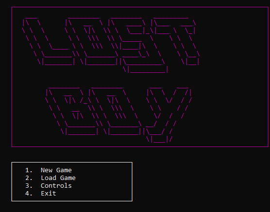

# Lost Boy

A retro console RPG built in C# / .NET 8. Explore dungeon maps, fight monsters, loot gear, and level up — all from your terminal.

 

## Gameplay

You wake up chained in a dark cellar with no memory of how you got there. A mysterious stranger sets you free and sends you into the depths below. Fight your way through Trolls, Ogres, and Demons across increasingly dangerous maps.

**Controls**

| Key | Action |
|-----|--------|
| `W` `A` `S` `D` | Move |
| `I` | Open inventory |
| `K` | Attack (in combat) |
| `R` | Run away (in combat) |
| `ESC` | Pause / Save |

Walk into an enemy to start a fight. Defeat all enemies on a map to advance to the next area.

## Features

- **Turn-based combat** with health bars, armor reduction, and loot drops
- **Inventory system** — equip armor and weapons across multiple slots, use consumable potions
- **Leveling** — gain EXP from kills, level up to increase HP, damage, and unlock better gear
- **Procedural maps** — terrain with pillars, water, rubble, torches, and wall segments
- **Multiple enemy types** — Trolls, Ogres (tankier), and Demons (hit harder)
- **Varied loot table** — swords, helms, gauntlets, boots, amulets, chainmail, and potions
- **Save / Load** — XML-based save files, pick up where you left off
- **Map progression** — The Cellar → The Dungeon → The Castle → The Abyss

## Building & Running

Requires [.NET 8 SDK](https://dotnet.microsoft.com/download/dotnet/8.0).

```
cd LostBoy
dotnet build
dotnet run --project LostBoy_Updated
```

Best experienced in Windows Terminal or the default Windows console at a reasonable window size.

## Project Structure

```
LostBoy/
├── LostBoy_Updated.sln
└── LostBoy_Updated/
    ├── Program.cs              # Entry point
    ├── Core/
    │   ├── Input.cs            # Keyboard polling with focus detection
    │   ├── Rng.cs              # Centralized random number generation
    │   ├── Stats.cs            # Stat system + fluent builder
    │   └── Vec2.cs             # 2D position struct
    ├── Entities/
    │   ├── Entity.cs           # Base class for all game entities
    │   ├── Player.cs           # Player character, equip/use/level logic
    │   └── Enemy.cs            # Enemy types, AI movement, loot
    ├── Items/
    │   ├── Item.cs             # Item base + all concrete items + loot table
    │   └── Inventory.cs        # Bag management, stacking, slot limits
    ├── Maps/
    │   └── Map.cs              # Map generation, terrain, enemy spawning
    ├── Rendering/
    │   └── Renderer.cs         # All console drawing (map, combat, inventory, HUD)
    └── Systems/
        ├── GameLoop.cs         # Main loop: menu, exploration, pause, inventory UI
        ├── CombatSystem.cs     # Combat encounter logic
        ├── SaveSystem.cs       # XML save/load
        └── StoryContent.cs     # All narrative text
```

## Roadmap

- [ ] More enemy types and boss encounters
- [ ] Weapon variety with critical hits
- [ ] Shops / NPC dialogue
- [ ] Sound effects via console beeps
- [ ] Room-based map generation with corridors
- [ ] Status effects (poison, stun, bleed)

## License

Personal project — feel free to look around and learn from it.
